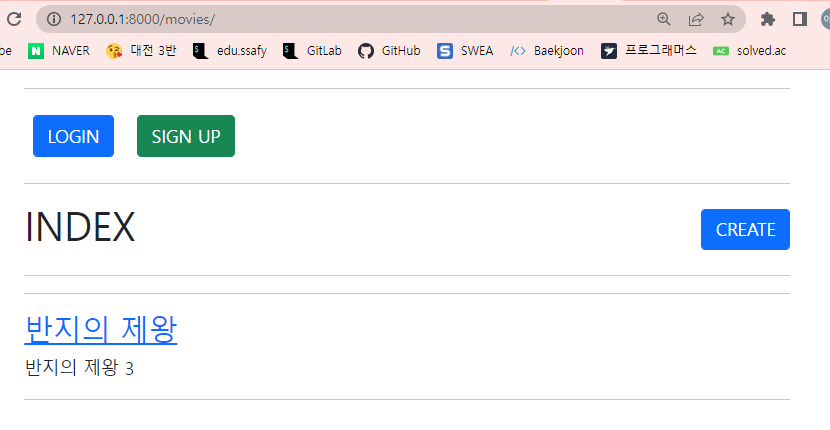
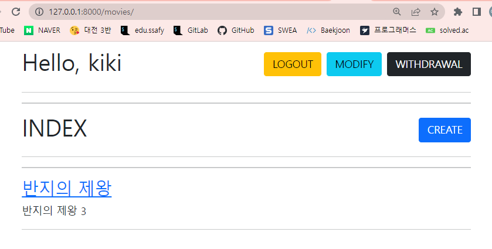
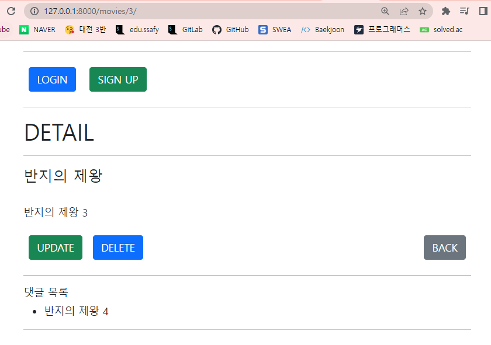
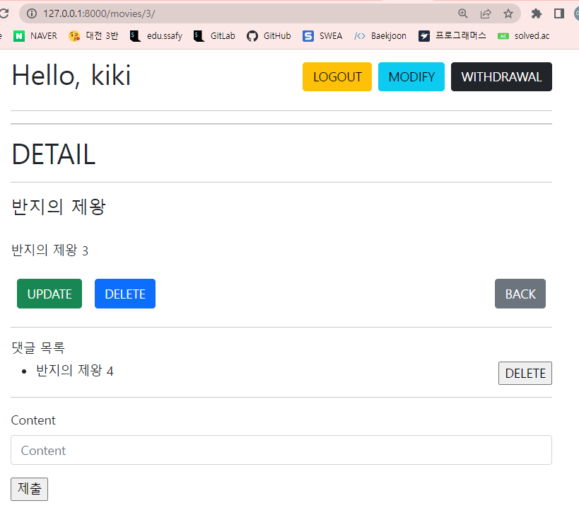
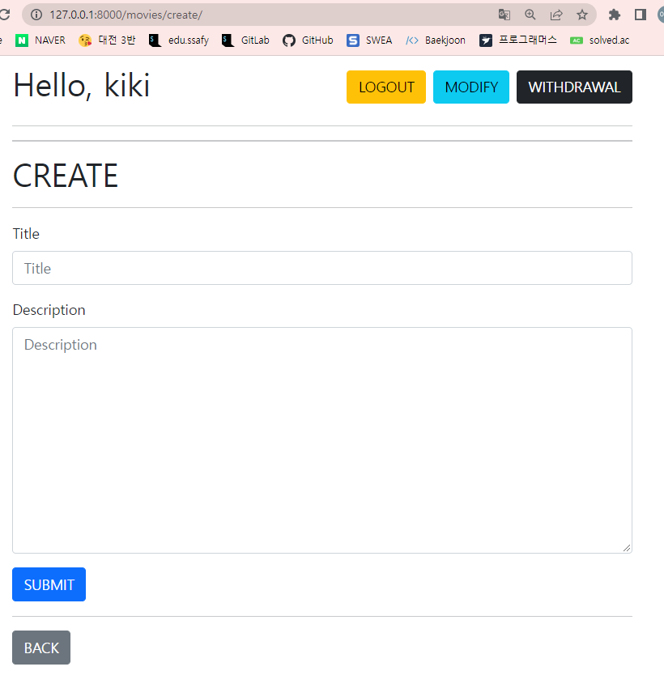
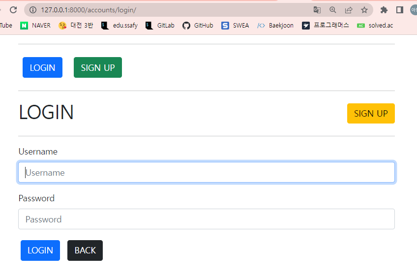
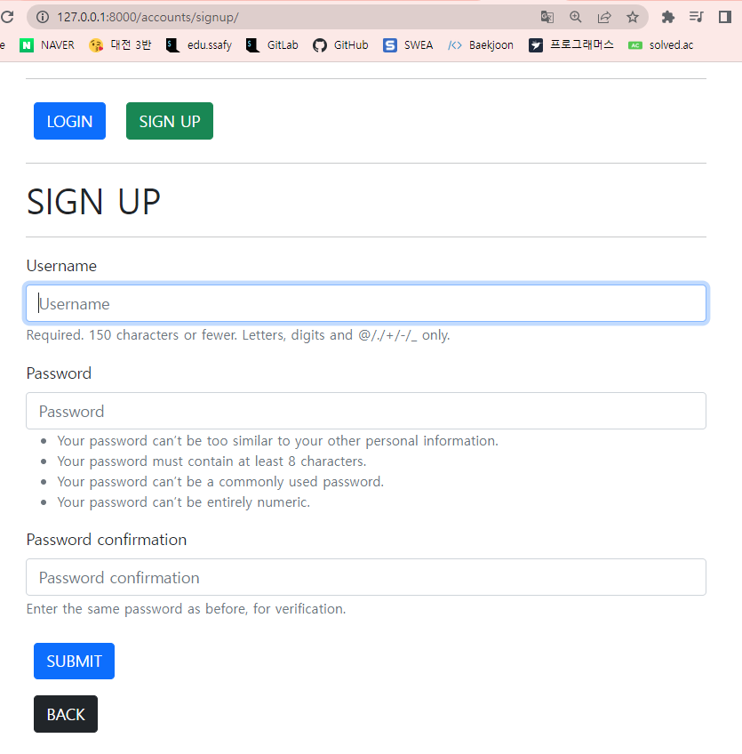

# pjt 07

> 사용자 인증기반 관계형 DB 설계

#### 🧐 T O D A Y

- 지난 프로젝트들처럼 데이터를 생성, 조회, 수정, 삭제할 수 있는 Web application을 제작해 보았다. 
- Django프레임워크크를 통해 데이터를 조작했다.
- Django Authentication System에 대한 이해와 Database many to one relationship에 대한 이해가 필요했다.

## 🧱 개발도구 및 라이브러리

1. Visual Studio Code
2. Google Chrome Browser
3. Bootstrap
4. Django 3.2.12 
   - pip install django==3.2.12

## 🔨 기본 틀 잡기

- 프로젝트 이름은 pjt07, 앱이름은 movies와 accounts로 accounts 하나가 늘어난 것을 제외하고는 지난번과 비슷했다.
- 지금까지는 기존 사용자 모델을 사용하였는데, 이는 내장 User모델이 제공하는 인증 요구사항이 적절하지 않을 수 있고, 장고에서 기본 사용자 모델이 충분하더라고 커스텀 유저 모델을 설정하는 것을 강력하게 권장하기 때문에 AUTH_USER_MODEL을 사용하여 default user model을 재정의하여 사용하였다. 
- 외래키도 프로젝트에서 처음 사용했다. 모델 클래스 Movie에서 user_id 필드가 User클래스를 참조하고 모델클래스 Comment에서 movie_id와 user_id가 각각 Movie와 User클래스를 참조하기 때문에 외래키를 사용하였다.

## 🌟 templates

### 1️⃣ 공유 템플릿(base.html) & 전체 영화목록 조회 템플릿(index.html)

#### 1. 비로그인 상태

- 비로그인 상태일 경우 로그인과 회원가입 버튼이 상단에 노출되고, create버튼을 누르면 로그인 창으로 연결된다.

  

#### 2. 로그인 상태

- 로그인 상태일 경우 상단에 Hello, + 'User'라는 문구가 뜨고, 우측에 로그아웃과 회원정보 수정, 탈퇴 버튼이 정렬되어 보인다.
- 또한 create버튼을 누르면 새 게시물을 작성할 수 있는 폼으로 연결된다.

### 2️⃣ 영화 상세 정보 페이지 (detail.html)

#### 1. 비로그인 상태

- 비로그인 상태일 경우 상단에 로그인과 회원가입 버튼이 보인다. 또한 update와 delete버튼이 보이기는 하지만 클릭 시 로그인 창으로 연결된다.
- 댓글목록은 보이지만 댓글을 작성, 삭제할 수는 없다.

#### 2. 로그인 상태

- 로그인 상태일 경우 상단은 index와 동일하게 보인다.
- update버튼을 누르면 영화정보를 수정할 수 있는 폼으로 연결되며  delete버튼을 누르면 해당 영화 데이터가 삭제된다.
- 로그인 상태이면 댓글을 작성할 수 있고, 댓글의 삭제는 해당 댓글을 작성한 user만 가능하다.

### 3️⃣ 영화 작성 페이지 (create.html)

#### 

- 영화 작성은 로그인 상태에만 가능하다. 비로그인 상태로 해당 url에 접근하면 로그인 창으로 redirect된다.
- 상단에 노출되는 폼은 인덱스에서 보이는 것과 같다.
- submit버튼을 누르면 작성한 영화정보 데이터가 저장되고 작성한 영화의 detail페이지로 이동한다. 

### 4️⃣ 영화 수정 페이지 (update.html)

#### 

- 영화 수정 역시 로그인 상태에만 접근 가능하다.
- 영화 정보를 수정하고 submit버튼을 누르면 해당 영화 정보가 수정되고 그 영화의 detail페이지로 이동한다.
- reset버튼을 누르면 영화 정보의 초기값으로 돌아간다.

### 5️⃣ 로그인 페이지 (login.html)

- 로그인 폼이 표시되는 페이지이다. 
- next parameter를 사용하여 로그인이 정상적으로 진행되면 기존에 요청했던 주소로 redirect 되게 했다.
- UserCreationForm을 사용해서 커스텀 폼을 만들어 사용하였다.

### 6️⃣ 회원가입 페이지(signup.html)

- 회원가입 form을 표시하는 페이지이다.
- submit을 눌렀을 때 작성한 정보가 유효하면 회원정보가 저장되고, login페이지로 연결된다.
- UserChangeForm을 사용해서 커스텀 폼을 만들어 사용하였다.

### 7️⃣ 회원정보 수정 페이지(update.html)

- 회원정보를 수정하는 form을 표시하는 페이지이다.
- 당연하겠지만 로그인 된 상태일 때 해당 user의 회원정보만을 수정할 수 있다.

### 8️⃣ 비밀번호 변경 페이지 (change_password.html)

- 비밀번호를 변경하는 form을 표시하는 페이지이다.
- 로그인 되어있는 유저의 비밀번호만을 변경할 수 있다.

## 💫 마무리

#### 오늘 내 실수들 + 배운 것들

- 여러번 반복해서 했던 부분도 있고 새롭게 배운 부분들도 있었는데, 거의 비슷한 방식으로 작성하고 사용하는 거라 프로젝트 전까지는 이 정도면 괜찮은데? 생각했었다. 그런데 막상 이전 코드들을 참고하지 않고 쌩으로 처음부터 프로젝트를 진행하려고 하니까 너무 어려웠다. 결국에는 교재도 찾아보고 구글링도 많이 하고 진짜 기억안나는 부분은 예전에 작성했던 코드까지 찾아봤는데, 반복연습과 복습이 중요하다는 걸 다시 한 번 깨달았다🤧
- 오늘은 새롭게 배운 부분보다는 장고 초반부터 많이 다뤘던 부분이 헷갈렸다. redirect와 render의 인자를 받는 부분에서도 헷갈렸었고, settings에 base directory를 작성하지 않는 실수를 하기도 했다. 기본적인 부분부터 챙기자!
- 데코레이터를 사용하는 부분에서도 실수가 있었다. login_required를 쓰는 경우와 user.is_authenticated를 쓰는 경우를 구분을 잘 못했다. 설명을 듣고 고쳤는데, 다시 한번 혼자 해봐야 체득할 것 같다,,😅
- 오늘은 페어와 함께 진행하는 프로젝트였다. 혼자 하는 것보다 진행 속도가 빨랐다. 또 오류가 나서 틀린 부분을 뒤늦게 고치는 경우가 많은데 페어와 함께 코드를 보면서 진행하니까 오류가 비교적 적었다. 이렇게 좋았던 부분도 있지만, 어려웠던 부분도 있었다. 내 작업방식과 페어의 작업 방식이 다른 경우도 있었고, 내가 중요하다고 생각해서 먼저 해결하고 싶어 하는 부분과 페어가 생각하는 중요한 부분이 다를 때도 있었다. 페어님께서 잘 맞춰주셔서 나는 수월하게 진행했는데, 나는 페어한테 잘 맞추지 못한 것 같아서 고맙고 죄송할 따름이다,, 내 의견을 존중해주신 페어님께 감사하며, 다음 페어 실습부터는 조금 더 좋은 협업의 모습을 갖추고 싶다.💪🏻💪🏻💪🏻